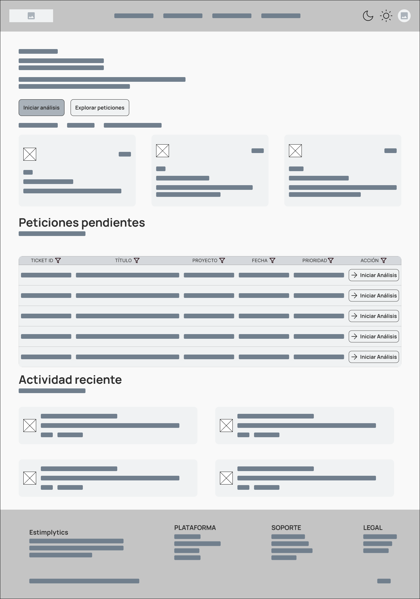
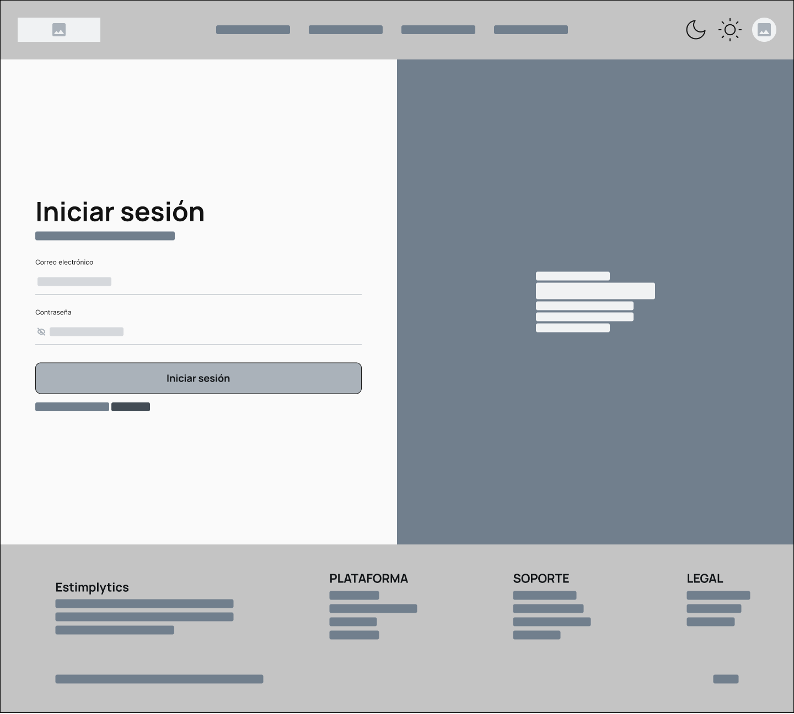
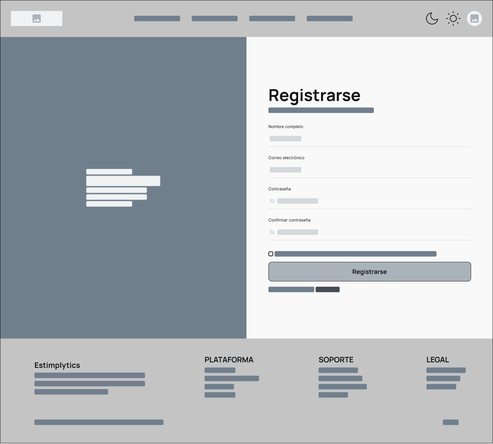
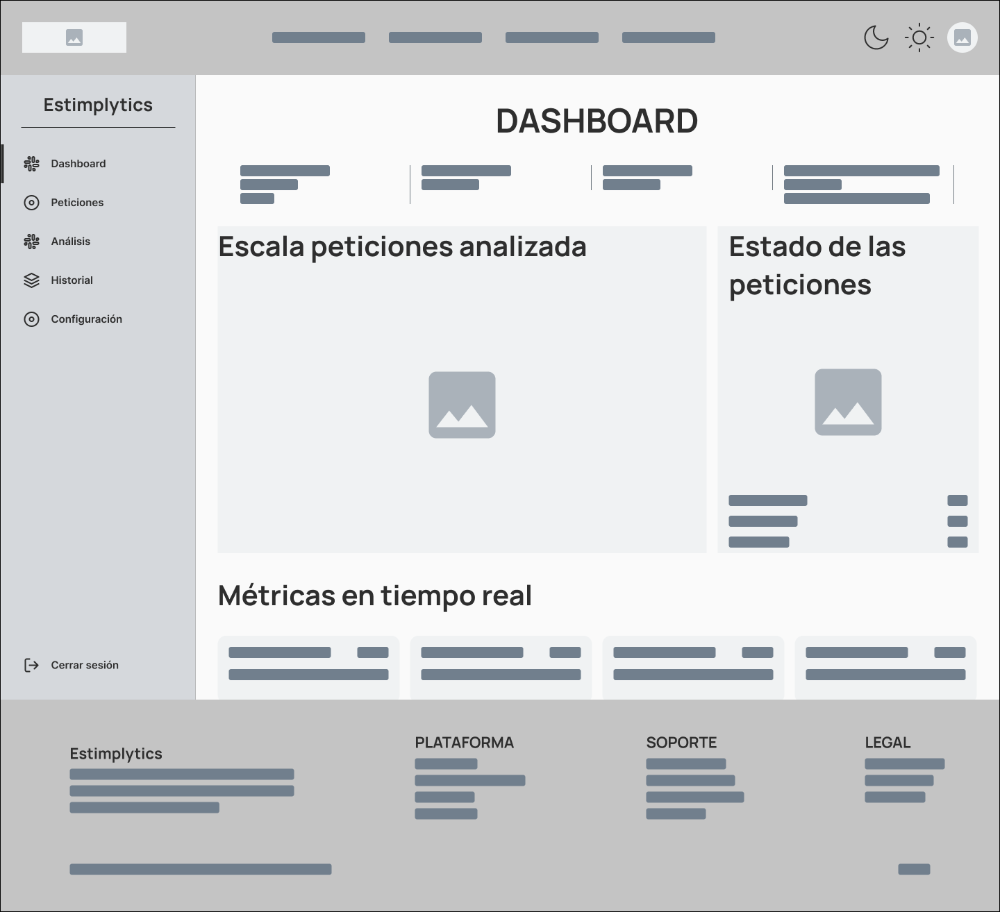
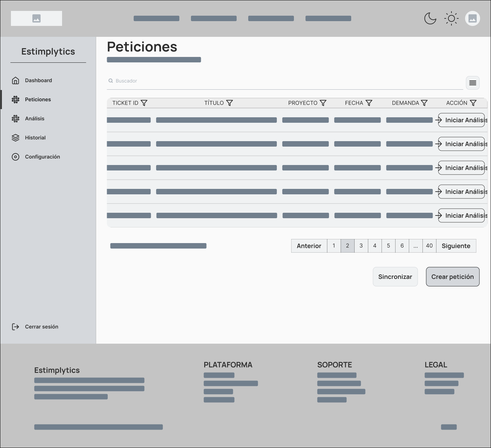
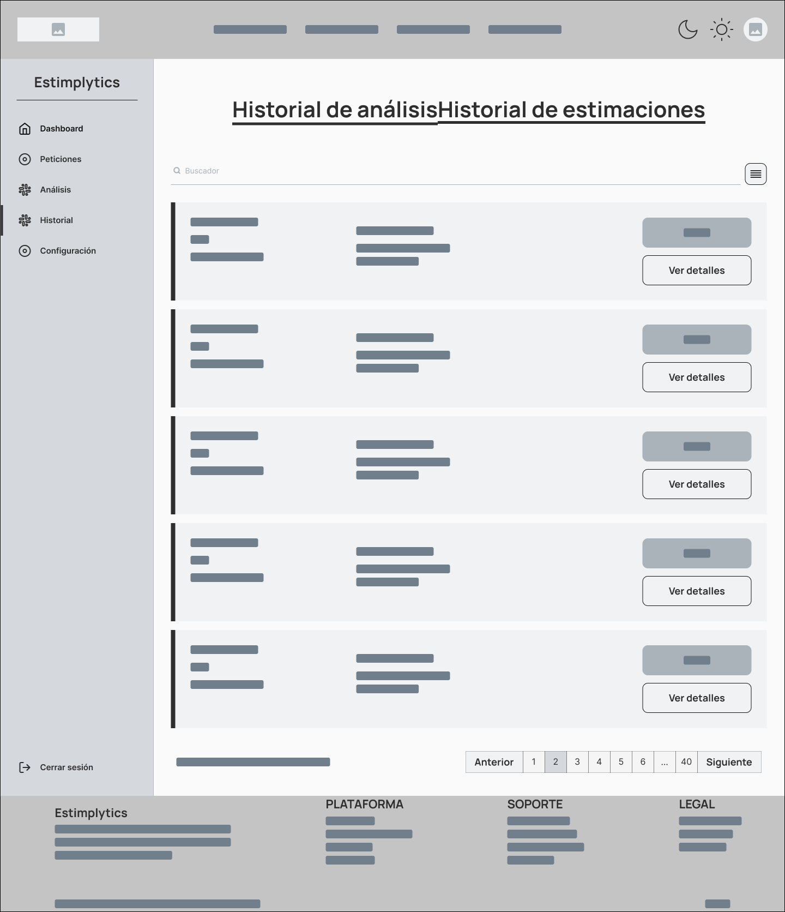
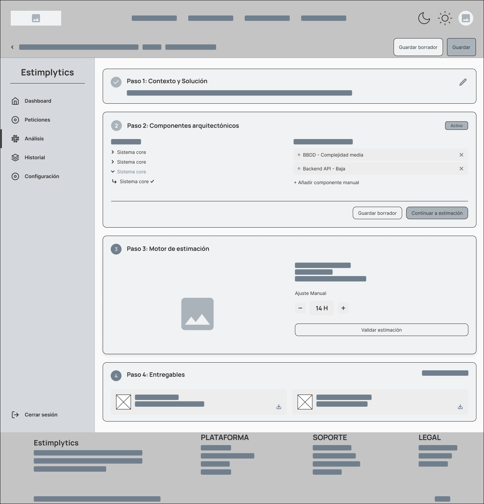
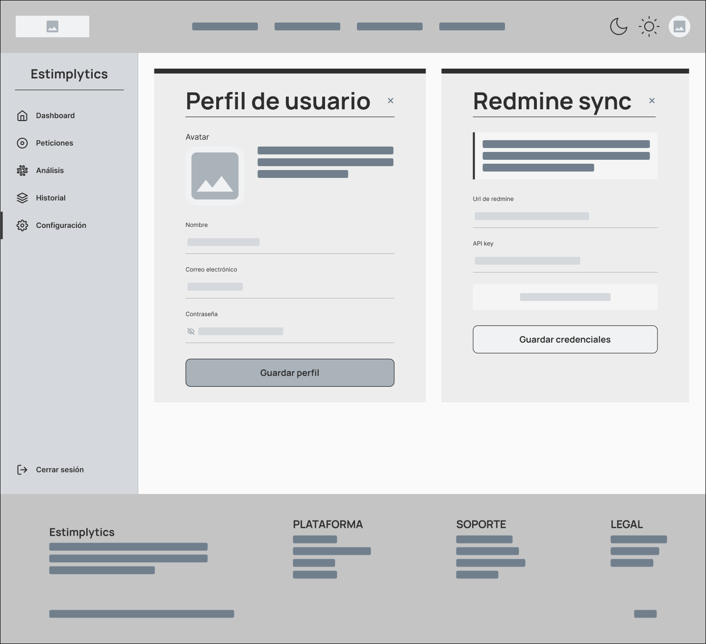

# Guía de estilos y prototipado

## Enlace Figma

[FIGMA](https://www.figma.com/design/dFRkyzMLYCrp1RaDMjYhwL/Estimplytics?)

## Guía de estilos: paleta, tipografías y espaciados

### Paleta de colores

#### Colores primarios

| Uso | Nombre | Código |
|---|---|---|
| Primario | [Color primario más claro] | `#E4F4FB` |
| Primario | [Color primario claro] | `#C7E6F3` |
| Primario | [Color primario menos claro] | `#6DBAD9` |
| Primario | [Color primario base] | `#088ABD` |
| Primario | [Color primario menos oscuro] | `#076E86` |
| Primario | [Color primario oscuro] | `#03394E` |
| Primario | [Color primario más oscuro] | `#022735` |

#### Colores secundarios

| Uso | Nombre | Código |
|---|---|---|
| Secundario | [Color secundario 1] | `#C4D86D` |
| Secundario | [Color secundario 2] | `#FFEDE0` |
| Secundario | [Color secundario 3] | `#A16769` |
| Secundario | [Color secundario 4] | `#22060D` |

#### Colores neutrales

| Uso | Nombre | Código |
|---|---|---|
| Neutral | [Color neutral 1] | `#F0F2F3` |
| Neutral | [Color neutral 2] | `#D5D8DC` |
| Neutral | [Color neutral 3] | `#AAB2BA` |
| Neutral | [Color neutral 4] | `#717F8D` |
| Neutral | [Color neutral 5] | `#434C55` |
| Neutral | [Color neutral 6] | `#21262A` |
| Neutral | [Color neutral 7] | `#111417` |

#### Colores semánticos

| Uso | Nombre | Código |
|---|---|---|
| Mensajes de éxito | [Color semántico éxito] | `#26AA41` |
| Mensajes de éxito (color más oscuro) | [Color semántico éxito oscuro] | `#176727` |
| Mensajes de error | [Color semántico error] | `#EE4343` |
| Mensajes de error (color más oscuro) | [Color semántico error oscuro] | `#A40E0E` |
| Mensajes de advertencia | [Color semántico advertencia] | `#F49E0A` |
| Mensajes de advertencia (color más oscuro) | [Color semántico advertencia oscuro] | `#925F06` |
| Mensajes de info | [Color semántico info] | `#3C83F5` |
| Mensajes de info (color más oscuro) | [Color semántico info oscuro] | `#0846AA` |

### Tipografía

| Tamaño | px |
|---|---|
| H1 | 48 |
| H2 | 40 |
| H3 | 32 |
| H4 | 26 |
| H5 | 22 |
| H6 | 18 |
| Párrafo | 16 |
| Texto pequeño | 14 |
| Texto super pequeño | 12 |
| Icono nav | 44 |
| Icono menú | 24 |
| Icono campos y botones | 20 |
| Iconos footer | 20 |
| Radio botón | 6 |
| Radio campo | 10 |
| Radio form | 30 |
| Radio S | 2 |
| Radio M | 6 |
| Radio L | 12 |
| Radio XL | 20 |
| Radio circunferencia | 9999 |
| Borde pequeño | 1 |
| Borde mediano | 2 |
| Borde grande | 3 |

### Espaciado

| Espaciado | px |
|---|---|
| Espaciado XS | 4 |
| Espaciado S | 8 |
| Espaciado M | 16 |
| Espaciado L | 24 |
| Espaciado XL | 32 |
| Espaciado XXL | 48 |
| Espaciado XXXL | 64 |

## Wireframes o mockups

### Pantallas principales

En este apartado se muestran las principales pantallas del sistema, junto con sus correspondientes wireframes y mockups.

#### Pantalla de inicio

La pantalla de inicio permite al usuario acceder a las funcionalidades principales de la aplicación y sirve como punto de entrada al sistema.

##### Wireframe



##### Mockup


---

#### Pantalla de autenticación

Esta pantalla gestiona el acceso de los usuarios mediante el proceso de inicio de sesión.

##### Wireframe



##### Mockup


---

#### Pantalla de registro

Permite la creación de nuevas cuentas dentro de la app.

##### Wireframe



##### Mockup


---

#### Panel principal (Dashboard)

El panel principal muestra un resumen general de la información más relevante para el usuario y facilita el acceso a las diferentes funcionalidades.

##### Wireframe



##### Mockup


---

#### Pantalla de peticiones

Permite visualizar, crear y gestionar las distintas peticiones realizadas dentro de la aplicación.

##### Wireframe



##### Mockup


---

#### Pantalla de historial

Muestra el historial de las peticiones analizadas y estimadas.


##### Wireframe



##### Mockup


---

#### Pantalla de análisis

Pantalla de la principal funcionalidad de la aplicación, 

##### Wireframe



##### Mockup


---

#### Pantalla de configuración

Permite al usuario personalizar parámetros y preferencias de la aplicación.

##### Wireframe



##### Mockup


### Navegación

La navegación de la aplicación sigue la siguiente estructura:

```text
Inicio
 ├── Login
 │     └── Dashboard
 |            |── Proyectos
 │            ├── Peticiones
 │            ├── Historial
 │            ├── Análisis
 │            └── Configuración
 │
 └── Registro
       └── Dashboard
```

## Componentes reutilizables

Para el diseño de la interfaz se ha adoptado la metodología **Atomic Design**, que propone construir sistemas de diseño de forma jerárquica y escalable, partiendo de los elementos más simples hasta llegar a las pantallas completas. Siguiendo este enfoque, los componentes se han diseñado y definido en Figma de menor a mayor complejidad: primero los átomos (elementos básicos como botones, campos o iconos), luego las moléculas (agrupaciones funcionales de átomos), después los organismos (secciones completas formadas por múltiples moléculas), y finalmente las plantillas y pantallas, que aglutinan todos los anteriores.

Cada una de las pantallas de la aplicación está construida íntegramente a partir de estos componentes, y a su vez cada sección de dichas pantallas contiene sub-componentes anidados, favoreciendo la coherencia visual y la reutilización a lo largo de todo el proyecto.

Se ha establecido como criterio general **componentizar todo elemento que aparezca más de una vez** en la interfaz, de modo que cualquier cambio en el componente se propague automáticamente a todas sus instancias.

### Componentes de formulario

Los componentes de formulario son algunos de los más relevantes del sistema de diseño, ya que aparecen en múltiples pantallas y contextos. Se han definido los siguientes elementos como componentes independientes con sus correspondientes variantes de estado:

- **Botones:** disponibles en distintos estilos (primario, secundario, destructivo, etc.) y con los estados *default*, *hover*, *focus*, *error*, *correct* y *disabled*.
- **Campos de texto (inputs):** con los estados *default*, *hover*, *focus*, *error*, *correct* y *disabled*.
- **Selects (desplegables):** con los estados *default*, *hover*, *focus* y *disabled*.
- **Checkboxes:** con los estados *default*, *hover*, *focus* y *disabled*.

Los estados *error* y *correct* están especialmente presentes en botones e inputs, ya que son los elementos más expuestos a la validación de datos por parte del usuario.

### Otros componentes

Además de los anteriores, se han creado componentes para todos los elementos que se repiten a lo largo de la interfaz: tarjetas, encabezados, menús de navegación, modales, badges, etiquetas de estado, tablas, avisos y notificaciones, entre otros. Cada uno de estos componentes incluye también variantes de estado cuando su naturaleza interactiva lo requiere, garantizando así que el comportamiento visual sea coherente en toda la aplicación.