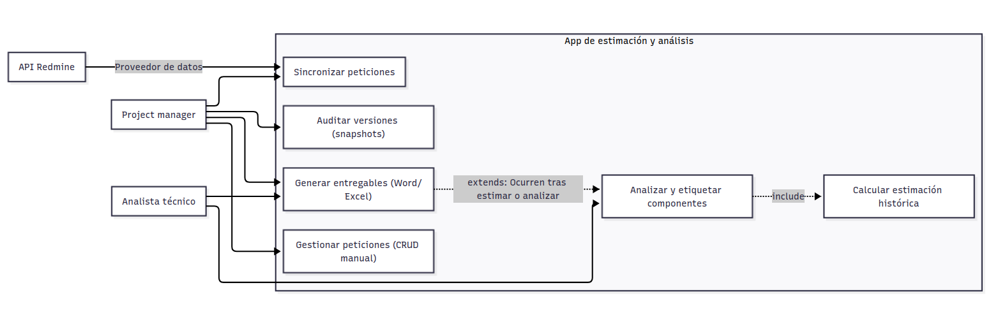

# Diseño

## Diagrama de casos de uso

Este diagrama define las interacciones entre los actores del sistema y las funcionalidades principales.

**Actores principales:**
-   **Analista Técnico:** Usuario principal que cataloga y estima las peticiones.
-   **Project Manager (PM) / Product Owner:** Revisa las auditorías (snapshots) y gestiona las peticiones de los proyectos.
-   **API de Redmine (Sistema externo):** Provee los tickets originales desde donde se saca el trabajo.

## Diagramas de flujo de procesos principales

Muestra el recorrido del usuario desde que selecciona un ticket hasta que se guarda la estimación final, incluyendo la lógica de decisión por si decide modificar la estimación sugerida que escupe el algoritmo.

## Arquitectura de la aplicación

La arquitectura sigue un modelo Cliente-Servidor (SPA + REST API) con una separación clara de responsabilidades. Está montada para ser un sistema escalable y fácil de mantener.

1.  **Capa de presentación (Frontend - Angular 21):**
    -   Single Page Application (SPA) que prescinde de módulos y usa componentes standalone.
    - Arquitectura ITCSS.
    -   Gestión de estado global usando Signals (`AppStateService`) para llevar el control del usuario logueado y el estado de carga sin meter librerías pesadas como NgRx.
    -   Uso de interceptores, como: interceptores HTTP (`logging.interceptor.ts`, `authInterceptor`) para inyectar el token JWT en cada petición y loguear los tiempos de respuesta. 
    -   Estructura basada en páginas y  componentes reutilizables.

2.  **Capa de lógica de negocio (Backend - Spring Boot):**
    El código fuente sigue un patrón estricto basado en dominios técnicos. Los paquetes literales son:
    -   `config/`: Archivos de configuración para CORS, Swagger, clientes HTTP y seguridad.
    -   `controller/`: Controladores REST. Usan una interfaz padre (`ICrudController`) para estandarizar las operaciones básicas en todas las rutas.
    -   `dto/`: Objetos de transferencia. Separados en `RequestDTO` (lo que entra), `ResponseDTO` (lo que sale) y `UpdateDTO` (para modificaciones). Así la base de datos queda aislada de las peticiones externas.
    -   `entity/`: Clases mapeadas directamente a las tablas de Postgres usando JPA.
    -   `exception/`: Clases de error a medida y un `ApiExceptionHandler` que pilla cualquier fallo de la aplicación y lo formatea en un JSON limpio (`ApiErrorDTO`).
    -   `mapper/`: Traductores que pasan datos de Entidad a DTO y viceversa.
    -   `repository/`: Interfaces de Spring Data JPA para atacar a la base de datos.
    -   `security/`: Lógica de autenticación, generación de tokens JWT (`JwtService`), filtros de seguridad y un servicio de lista negra para invalidar tokens al hacer logout.
    -   `service/`: El cerebro de la app. Destacan dos servicios clave:
        -   `EstimationAlgorithmService`: El algoritmo que calcula horas sugeridas y porcentajes de fiabilidad buscando componentes repetidos en el historial.
        -   `RedmineIntegrationService`: El proceso que ataca a la API de Redmine para traerse los JSON de los tickets y convertirlos en peticiones locales (`Request`).

3.  **Capa de persistencia (Base de datos relacional - PostgreSQL):**
    Diseñada para la trazabilidad y la mantenabilidad de los datos de la aplicación. Su documentación se encuentra en [database.md](./resources/database.md)

## Diseño de la API (endpoints y respuestas)

Para revisar el detalle completo de los modelos, esquemas y códigos de estado HTTP, entra en la interfaz de Swagger levantando el backend y yendo a `http://localhost:8080/swagger-ui/index.html`.

Aquí tienes un resumen de la estructura de rutas indicando el método del controlador que procesa cada llamada:

**Módulo de Autenticación (`AuthController`)**
-   Método `login` -> `POST /api/auth/token`: Recibe email y contraseña. Devuelve un `TokenResponseDTO` con el JWT y el tiempo de expiración.
-   Método `logout` -> `POST /api/auth/logout`: Invalida el token actual mandándolo a la lista negra.

**Módulos de Negocio (Rutas CRUD)**
Casi todas las entidades (Components, Estimations, ImpactAnalyses, Projects, Requests, Users) implementan la interfaz `ICrudController`, por lo que comparten estos cinco métodos y endpoints base (usando `/api/requests` como ejemplo):
-   Método `getAll` -> `GET /api/requests`: Devuelve una página (`Page<ResponseDTO>`) con todos los registros.
-   Método `getById` -> `GET /api/requests/{id}`: Devuelve el objeto completo (`ResponseDTO`) filtrado por su UUID.
-   Método `create` -> `POST /api/requests`: Recibe un `RequestDTO` y crea un registro. Devuelve un código 201 y el objeto creado.
-   Método `update` -> `PUT /api/requests/{id}`: Recibe un `UpdateDTO` para modificar campos específicos.
-   Método `delete` -> `DELETE /api/requests/{id}`: Borra el registro de la base de datos (código 204).

Las rutas que siguen este patrón son:
-   `/api/component-analyses`
-   `/api/components`
-   `/api/estimations`
-   `/api/estimation-histories` (El método update y el método delete devuelven error, están bloqueados por seguridad).
-   `/api/impact-analyses`
-   `/api/impact-analysis-histories` (Igual que el anterior, modificaciones bloqueadas).
-   `/api/projects`
-   `/api/requests`
-   `/api/users`

**Módulo de Integración con Redmine (`RedmineIntegrationController`)**
-   Método `syncIssues` -> `POST /api/redmine/sync`: Recibe un parámetro `credentialId`. Se conecta a Redmine, procesa los tickets y devuelve un string de confirmación con el número de registros sincronizados.

**Módulo de Credenciales (`UserRedmineCredentialController`)**
-   Método `getMyCredentials` -> `GET /api/v1/redmine-credentials`: Devuelve una lista con las credenciales del usuario logueado (ocultando la API Key por seguridad).
-   Método `addCredential` -> `POST /api/v1/redmine-credentials`: Recibe un `CreateCredentialCmd` con la API key en texto plano, la encripta y la guarda asociada al usuario.

