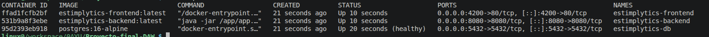
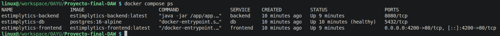
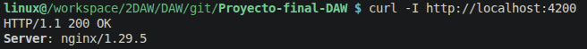
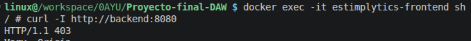
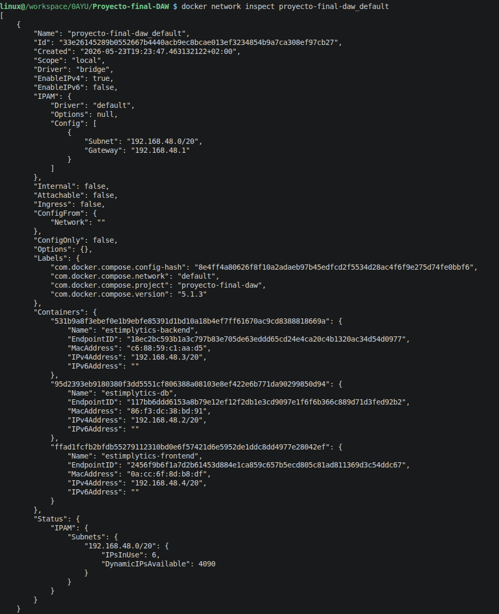

# Despliegue de la aplicación web

## Criterio 7 (RA4)

Para levantar el proyecto, he dockerizado la aplicación y subida de las imágenes a docker hub. Todo la configuración está centralizada en estos archivos:
-   [docker-compose.yml](../docker-compose.yml): El orquestador que define y enlaza la base de datos, el backend y el frontend.
-   [backend/Dockerfile](../backend/Dockerfile): El archivo que define los pasos para construir la imagen del backend.
-   [frontend/Dockerfile](../frontend/Dockerfile): El archivo que empaqueta Angular y configura Nginx.
-   [.github/workflows/hub.yml](../.github/workflows/hub.yml): El workflow encargado de la subida de las imágenes a DockerHub.


El docker compose define tres servicios conectados entre sí mediante una red interna de Docker:
- **db:** Contenedor de PostgreSQL 16 con un volumen persistente (`postgres_data`) y un healthcheck que bloquea el arranque del backend hasta que la base de datos esté lista.
- **backend:** Contenedor con el JAR de Spring Boot. Depende de `db` y recibe las credenciales a través de variables de entorno.
- **frontend:** Contenedor con Nginx sirviendo la build de Angular. Depende del backend y expone el puerto hacia el exterior.

Para los Dockerfile:
- **Dockerfile del backend**: Usa un proceso de construcción dividido en dos etapas:
    1. **Fase build:** Usa la imagen `maven:3.9-eclipse-temurin-21`, copia el código y lanza `mvn package` saltando los tests para compilar el archivo `.jar` más rápido.
    2. **Fase runtime:** Pilla una imagen ligera `eclipse-temurin:21-jre`, coge solo el archivo `.jar` compilado y lo ejecuta. Así se evita dejar dependencias inútiles en el contenedor final.

- **Dockerfile del frontend + nginx.conf**
    1. **Fase builder:** Usa la imagen `node:22-alpine`, instala las dependencias con `npm ci` y lanza la compilación estricta de Angular (`npm run build`).
    2. **Fase server:** Monta un servidor `nginx:alpine`, copia los archivos estáticos y mete el archivo `nginx.conf` que actua como proxy inverso.


El proceso automatizado genera artefactos compilados: Maven empaqueta el backend en un archivo ejecutable `app.jar`, y Angular compila los archivos estáticos de la web (HTML, CSS y JS). Estos artefactos se inyectan dentro de sus respectivas imágenes Docker, que finalmente subo al registro de DockerHub bajo las etiquetas `dmon5/estimplytics-backend:latest` y `dmon5/estimplytics-frontend:latest`.

Para mantener la seguridad y evitar que las imágenes pesen demasiado, lo he configurado usando el .dockerignore, para evitar copiar directorios innecesarios y de gran tamaño. Por ejemplo, en el frontend: [frontend/.dockerignore](../frontend/.dockerignore), no añade node_modules, ni documentación a la imagen final:

```text
node_modules
dist
.angular
coverage
.git
*.md
```

Respecto a las credenciales, en el repositorio solo mantengo un archivo plantilla [.env.example](../.env.example). El archivo `.env` definitivo, que contiene las credenciales reales y variables sensibles, lo creo manualmente en el servidor y nunca se incluye en el control de versiones. Este es el contenido de la plantilla que uso de base:

```env
# Base de datos PostgreSQL
POSTGRES_DB=
POSTGRES_USER=
POSTGRES_PASSWORD=
POSTGRES_PORT=

# Backend Spring Boot
BACKEND_PORT=
SPRING_JPA_HIBERNATE_DDL_AUTO=
JWT_SECRET=
JWT_EXPIRATION=

# Frontend Nginx
FRONTEND_PORT=
```

Finalmente, he tenido en cuenta la persistencia de datos. Los contenedores por diseño son efímeros, por lo que si el contenedor de PostgreSQL se detiene, se perderían todos los usuarios y peticiones. Para solucionarlo, en el archivo [docker-compose.yml](../docker-compose.yml) he definido un volumen de Docker llamado `postgres_data`. Este volumen vincula el directorio interno de PostgreSQL con el disco duro del servidor, asegurando que la información sobreviva a reinicios.

## Criterio 8 (RA5)

He diseñado la arquitectura de red para que los usuarios accedan exclusivamente al frontend a través del puerto 80 (HTTP). Para proteger la API y solucionar los problemas de rutas cruzadas (CORS), he configurado Nginx no solo como servidor web, sino como proxy inverso.

El archivo donde he implementado esta lógica es:
-   [nginx.conf](../frontend/nginx.conf): Contiene las reglas de enrutamiento del servidor web.

Dentro de este archivo de configuración, he definido que cualquier petición cuya ruta empiece por `/api/` sea capturada por Nginx y redirigida por la red interna al contenedor del backend a través de su puerto 8080. Así, el backend no necesita estar expuesto a internet. El bloque exacto que gestiona esto es el siguiente:

```nginx
    # Proxy para el backend
    location /api/ {
        set $backend_upstream "http://backend:8080";
    
        proxy_pass $backend_upstream;
        
        proxy_http_version 1.1;
        proxy_set_header Upgrade $http_upgrade;
        proxy_set_header Connection 'upgrade';
        proxy_set_header Host $host;
        proxy_cache_bypass $http_upgrade;
    }
```

Para verificar que toda esta configuración de red funciona correctamente, he realizado tres comprobaciones en la terminal del servidor:

1. Compruebo el estado de los servicios ejecutando el comando en la terminal:

    ```bash
    docker ps
    # O también si se hace desde la misma ruta que el docker-compose
    docker compose ps
    ```
    

    La consola muestra los tres contenedores (db, backend y frontend) activos con el estado UP. Revisando la columna de puertos en la salida de este comando, verifico que el único puerto mapeado al exterior es el 80 del frontend, mientras que los puertos de la base de datos y del backend no tienen redirección al host y solo son accesibles desde la red interna de Docker.

    En desarrollo, el backend y la base de datos están expuestos:

    

2. Verifico la disponibilidad de la web en local ejecutando el comando (o una ruta diferente dependiendo de la real), en localhost, en el puerto 4200: 

    ```bash
    curl -I http://localhost:4200
    ```
    

    Este comando solicita las cabeceras HTTP de la página principal. La respuesta devuelve un código `200 OK`, lo cual confirma que el contenedor de Nginx está escuchando peticiones y sirviendo la aplicación de Angular correctamente. 
    
    En el caso del backend, como no se expone el puerto, no se puede conectar.

3. Por último, valido la comunicación interna entre el frontend y el backend a través del proxy. Para ello, he entrado al contenedor del frontend y he ejecutado este comando curl con dominio backend (configurado en nginx): 

    ```bash
    docker exec -it estimplytics-frontend sh
    \ curl -I http://backend:8080
    ```
    
    
    Como esta ruta en la API está protegida y requiere un token de sesión que no estoy enviando en el curl, la salida devuelve un error `403 Forbidden`. Esto demuestra que Nginx ha interceptado la petición y la ha enrutado sin problemas hacia el backend de Spring Boot, validando la conexión entre los dos contenedores.

    También he comprobado si los 3 contenedores pertenecían en la misma red mediante este comando:

    ```bash
    docker network inspect proyecto-final-daw_default
    ```

    