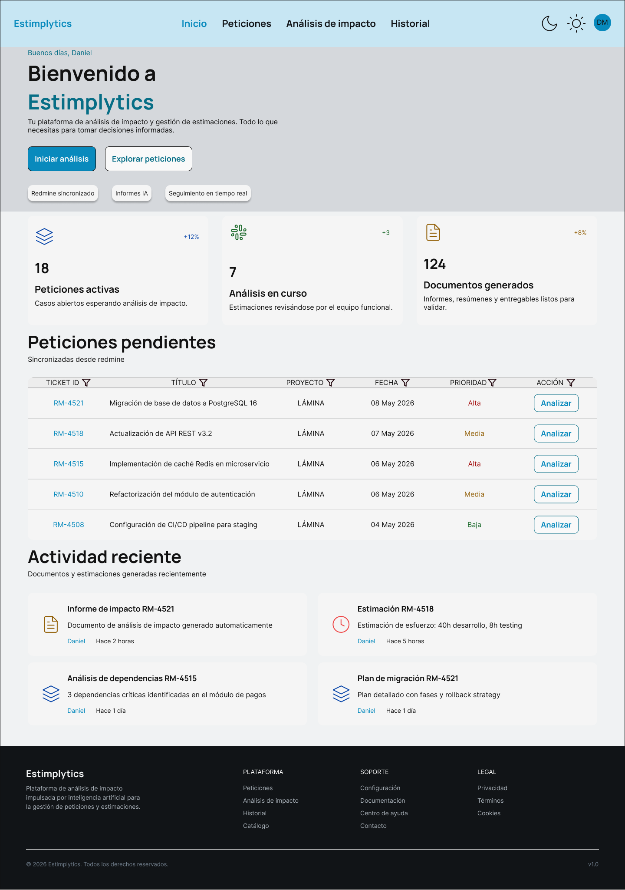
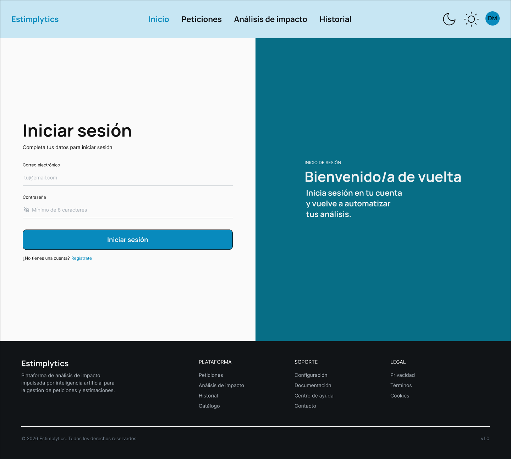
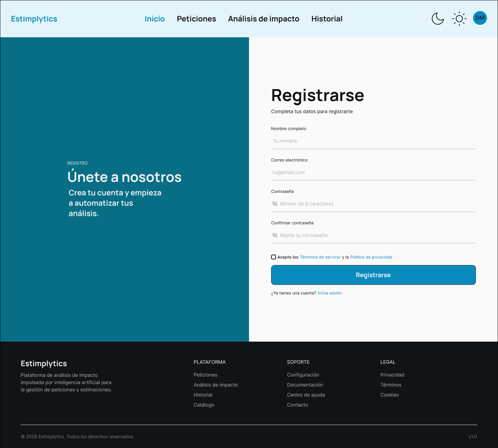
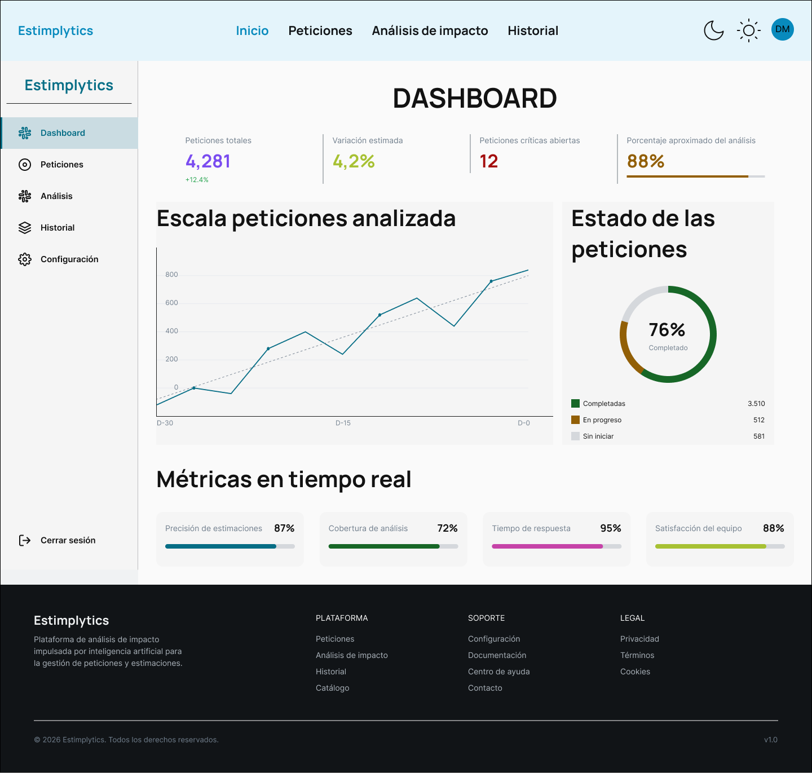
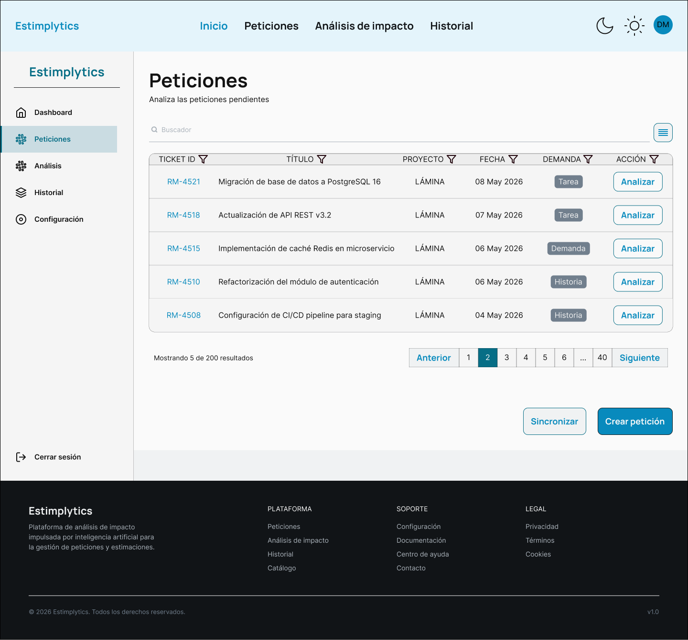
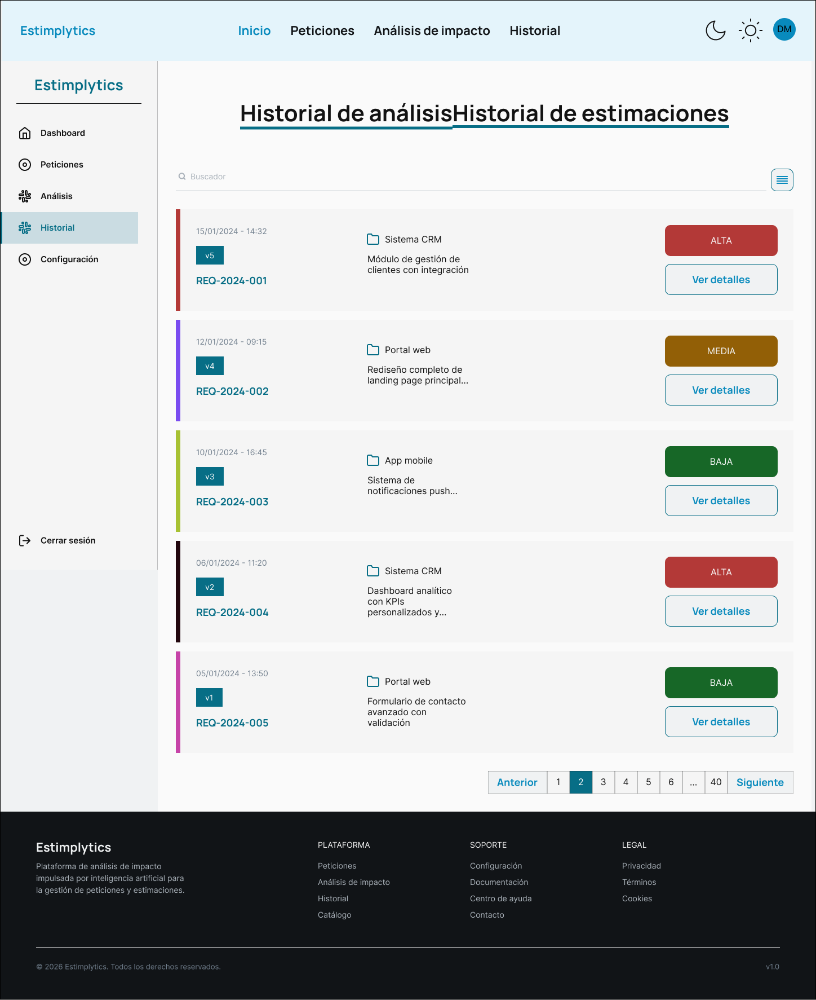
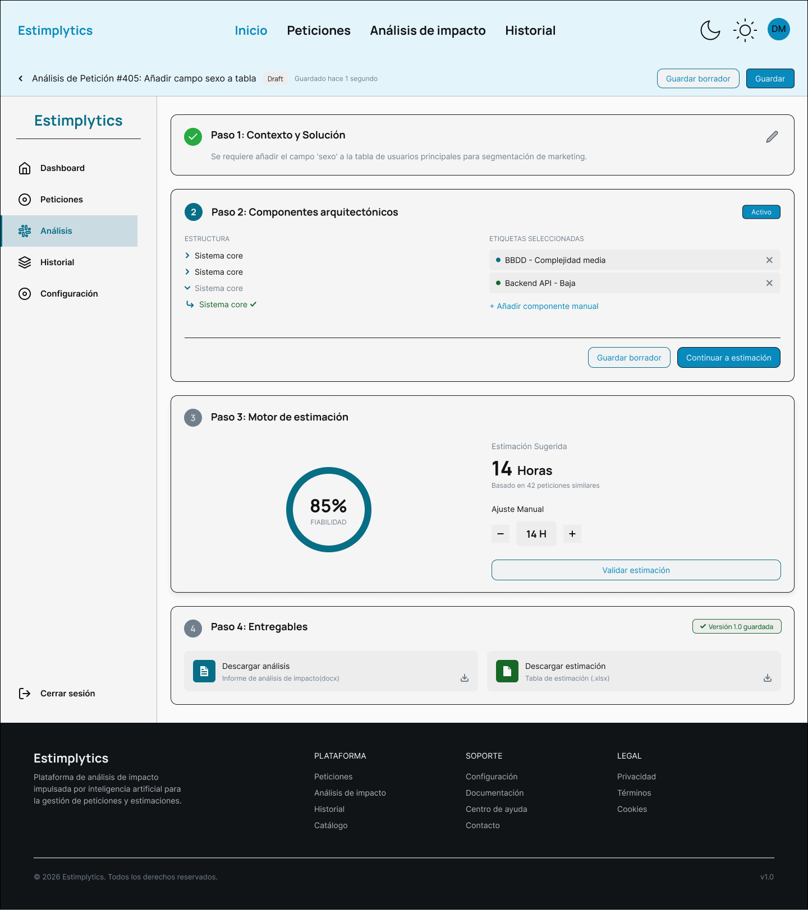
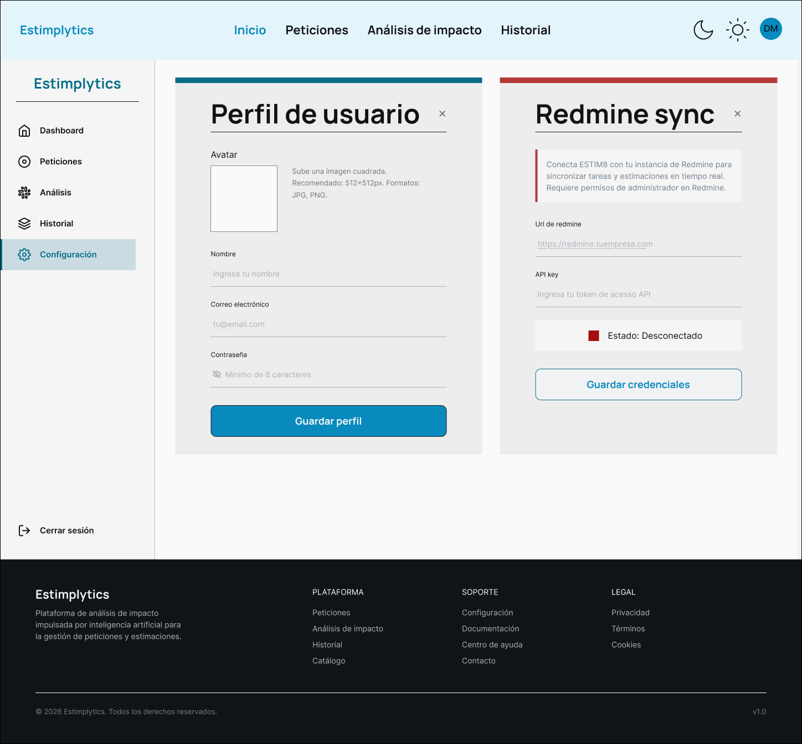

# Manual de usuario

## Guía de uso de la aplicación

Esta guía describe cómo utilizar **Estimplytics** desde el primer acceso hasta la generación de los documentos de entrega. La aplicación está diseñada para que el flujo sea secuencial e intuitivo, de modo que un analista sin experiencia previa en la herramienta pueda completar un análisis completo en su primera sesión.

### Acceso a la aplicación

Al abrir la URL de la aplicación, el sistema muestra la **pantalla de inicio**, desde la que el usuario puede acceder al formulario de inicio de sesión o al registro de una nueva cuenta.

- Si ya se dispone de cuenta, pulsar **"Iniciar sesión"** para ir al formulario de autenticación.
- Si es la primera vez, pulsar **"Registrarse"** para crear una cuenta nueva introduciendo nombre, correo y contraseña.

Una vez autenticado correctamente, el sistema redirige automáticamente al **Dashboard**.

### Panel principal (Dashboard)

El Dashboard es el punto de partida tras cada inicio de sesión. Muestra un resumen del estado actual del usuario.

- **Accesos directos:** botones para ir directamente a la pantalla de peticiones, historial, análisis o configuración.

Desde la barra lateral de navegación (disponible en todo momento) se puede acceder a cualquier sección de la aplicación.

### Gestión de peticiones

La pantalla de **Peticiones** permite visualizar y gestionar todas las peticiones disponibles en el sistema.

#### Sincronización con Redmine

Si la organización dispone de Redmine configurado, la aplicación puede importar automáticamente las peticiones abiertas. Para ello:

1. Acceder a la pantalla de **Configuración**.
2. Introducir la URL de la instancia de Redmine y la clave de API del usuario.
3. Pulsar **"Sincronizar"**. El sistema vuelca en la base de datos local todas las peticiones pendientes.

#### Creación manual de peticiones

Para entornos sin Redmine, o para añadir peticiones ad hoc:

1. En la pantalla de Peticiones, pulsar **"Nueva petición"**.
2. Rellenar los campos obligatorios: título, descripción y proyecto asociado.
3. Pulsar **"Guardar"**. La petición queda disponible para su análisis.

#### Edición y eliminación

Cada petición dispone de un menú de acciones para editarla o eliminarla. Las peticiones que ya tienen un análisis generado no pueden eliminarse directamente para preservar la trazabilidad.

---

## Capturas de pantalla de funcionalidades principales

A continuación se muestran las pantallas principales de la aplicación tal como aparecen al usuario.

### Pantalla de inicio

Punto de entrada a la aplicación, con accesos a login y registro.

### Pantalla de autenticación (Login)

Formulario de inicio de sesión con validación en tiempo real. Si el correo o la contraseña son incorrectos, el sistema muestra un mensaje de error descriptivo bajo el campo afectado.

### Pantalla de registro

Formulario de creación de cuenta. Incluye validación de coincidencia de contraseñas y comprobación de formato de correo electrónico.

### Panel principal (Dashboard)

Vista general con el resumen de actividad y los accesos rápidos a las funcionalidades principales.

### Pantalla de peticiones

Listado de todas las peticiones del sistema, con filtros por estado y proyecto, y acciones de creación, edición y eliminación.

### Pantalla de historial

Registro de todos los análisis completados, con sus versiones (*snapshots*) y la posibilidad de descargar los documentos generados en cualquier momento.

### Pantalla de análisis

Pantalla central de la aplicación donde se realiza el análisis de impacto y se genera la estimación.

### Pantalla de configuración

Ajustes de la cuenta y configuración de la integración con Redmine.

---

## Casos de uso paso a paso

### Caso 1: Analizar y estimar una petición

Este es el flujo principal de la aplicación. Permite convertir una petición en un análisis de impacto con estimación de horas.

**Pasos:**

1. Desde el **Dashboard**, localizar la petición pendiente en la lista o acceder a **Peticiones** desde el menú lateral.
2. Pulsar sobre la petición deseada para abrirla y revisar su descripción.
3. Pulsar **"Iniciar análisis"**. El sistema abre el asistente de análisis estructurado.
4. En el paso **"Marcado de componentes"**, desplegar el árbol de arquitectura y seleccionar mediante etiquetas los módulos que se verán afectados por el cambio: `Frontend`, `BBDD`, `DAOs`, `Servicios`, etc. Para cada etiqueta seleccionada, indicar el nivel de complejidad (bajo, medio, alto).
5. Opcionalmente, redactar una breve **solución técnica propuesta** en el campo de texto disponible.
6. Pulsar **"Calcular estimación"**. El motor algorítmico consulta el histórico de peticiones cerradas con etiquetas similares y devuelve:
   - **Horas sugeridas:** valor medio calculado a partir de tareas históricas equivalentes.
   - **Índice de fiabilidad:** porcentaje que indica la solidez estadística de la sugerencia en función del volumen de datos coincidentes.
7. Revisar la estimación. Si es necesario ajustarla, modificar el valor manualmente en el campo editable.
8. Pulsar **"Generar entregables"**. El servidor procesa los datos y el navegador descarga automáticamente los dos documentos corporativos:
   - `Análisis_de_Impacto.docx`
   - `Planificación_de_Recursos.xlsx`

La petición queda registrada en el **Historial** como analizada, con su versión inicial `v1.0`.

---

### Caso 2: Revisar y actualizar un análisis existente

Si el cliente solicita un cambio en el alcance o el analista detecta un error en la estimación original, es posible actualizar el análisis sin perder el historial.

**Pasos:**

1. Acceder a la pantalla de **Historial**.
2. Localizar el análisis que se desea modificar y pulsar **"Editar"**.
3. Realizar los cambios necesarios: añadir o quitar etiquetas de componentes, modificar la solución técnica o ajustar las horas.
4. Pulsar **"Guardar nueva versión"**. El sistema no sobreescribe el análisis anterior, sino que crea una nueva versión (por ejemplo, `v1.1`), preservando el registro inmutable de todas las revisiones.
5. Desde el historial, es posible descargar los documentos de cualquier versión anterior en cualquier momento.

---

### Caso 3: Configurar la integración con Redmine

**Pasos:**

1. Acceder a **Configuración** desde el menú lateral.
2. En el bloque **"Integración con Redmine"**, introducir:
   - **URL base** de la instancia de Redmine (por ejemplo, `https://redmine.miempresa.com`).
   - **Clave de API** del usuario (se obtiene en el perfil de Redmine, sección *"Clave de acceso a la API"*).
3. Pulsar **"Guardar configuración"**. El sistema valida la conexión.
4. Una vez guardada, volver a la pantalla de **Peticiones** y pulsar **"Sincronizar con Redmine"** para importar las peticiones abiertas.

---

## FAQ y solución de problemas comunes

### ¿Por qué no aparecen peticiones tras sincronizar con Redmine?

Verificar que la clave de API introducida en la configuración es correcta y pertenece a un usuario con permisos de lectura sobre los proyectos de Redmine. También comprobar que la URL base no incluye barra final (ejemplo correcto: `https://redmine.miempresa.com`).

### ¿Qué significa un Índice de Fiabilidad bajo?

Un índice bajo (por ejemplo, por debajo del 50%) indica que el motor de estimación encontró pocas peticiones históricas con etiquetas similares. En ese caso, la sugerencia de horas es orientativa y se recomienda que el analista la revise y ajuste manualmente. A medida que se completen más análisis, la base histórica crece y el índice mejora.

### ¿Puedo usar la aplicación sin tener Redmine?

Sí. La integración con Redmine es opcional. La aplicación dispone de un gestor interno completo que permite crear, editar y eliminar peticiones manualmente. Todas las funcionalidades de análisis, estimación y generación de documentos están disponibles independientemente.

### Los documentos descargados tienen campos en blanco, ¿qué ha ocurrido?

Esto puede ocurrir si el análisis se generó sin rellenar todos los campos opcionales (como la solución técnica propuesta). Para obtener los documentos completos, editar el análisis desde el **Historial**, completar los campos vacíos y generar una nueva versión.

### ¿Cómo recupero la contraseña?

En la pantalla de **Login**, pulsar el enlace **"¿Has olvidado tu contraseña?"** e introducir el correo electrónico asociado a la cuenta. El sistema enviará un correo con instrucciones para restablecerla.

### La estimación calculada parece incorrecta, ¿puedo modificarla?

Sí. El valor sugerido por el algoritmo es editable. Una vez calculada la estimación, el campo de horas queda habilitado para introducir manualmente el valor que el analista considere más adecuado. Este valor ajustado es el que se incluirá en los documentos generados.

### ¿Es posible descargar de nuevo los documentos de un análisis antiguo?

Sí. Acceder a la pantalla de **Historial**, localizar el análisis y pulsar el botón de descarga junto a la versión deseada. Los documentos de todas las versiones están disponibles en cualquier momento.
